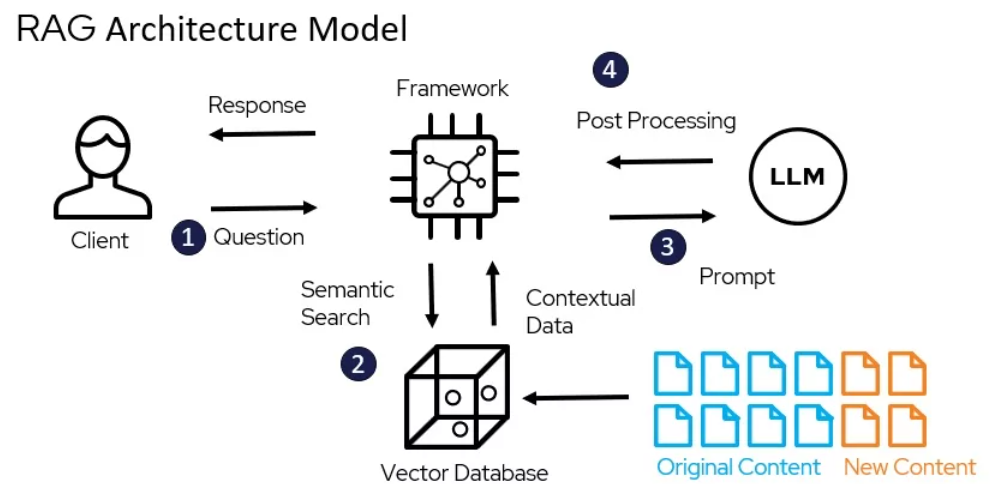

# RAG-with-Milvus
This repository implements a Retrieval-Augmented Generation (RAG) using the Milvus vector store, designed specifically for PDF documents. By integrating Milvus, a highly efficient vector database, this project enables fast and scalable storage and retrieval of PDF embeddings, allowing for knowledge extraction from a large collection of documents.

## RAG Architecture
[](https://medium.com/@bijit211987/designing-high-performing-rag-systems-464260b76815)

## Follow below steps Steps
### 1. Add Open-AI API key:
```python
# ingest_pdf.py
Line 31: os.environ["OPENAI_API_KEY"] = "sk-proj-xxxxxxxxxxxxxxxxxxxxxxxxxxxxxxxxxxxxxx"

# main_interface.py
Line 11: os.environ["OPENAI_API_KEY"] = "sk-proj-xxxxxxxxxxxxxxxxxxxxxxxxxxxxxxxxxxxxxx"
```

### 2. Start Milvus Server using Docker
For Windows, open CMD and run the command:
1. ```
   wsl
   ```
2. ```
   curl -sfL https://raw.githubusercontent.com/milvus-io/milvus/master/scripts/standalone_embed.sh -o standalone_embed.sh
   ```
3. ```
   bash standalone_embed.sh start
   ```

### 3. Add PDFs to vector store using script 'ingest_pdf.py'
This script loads PDFs from the New_PDFs folder and embed them to the Milvus vector store

### 4. Run interface using 'main_intercae.py'
This script works as the main interface for the chatbot.

## Feedback
If you have any feedback, please reach out to me at sahil.sharma@fau.de
